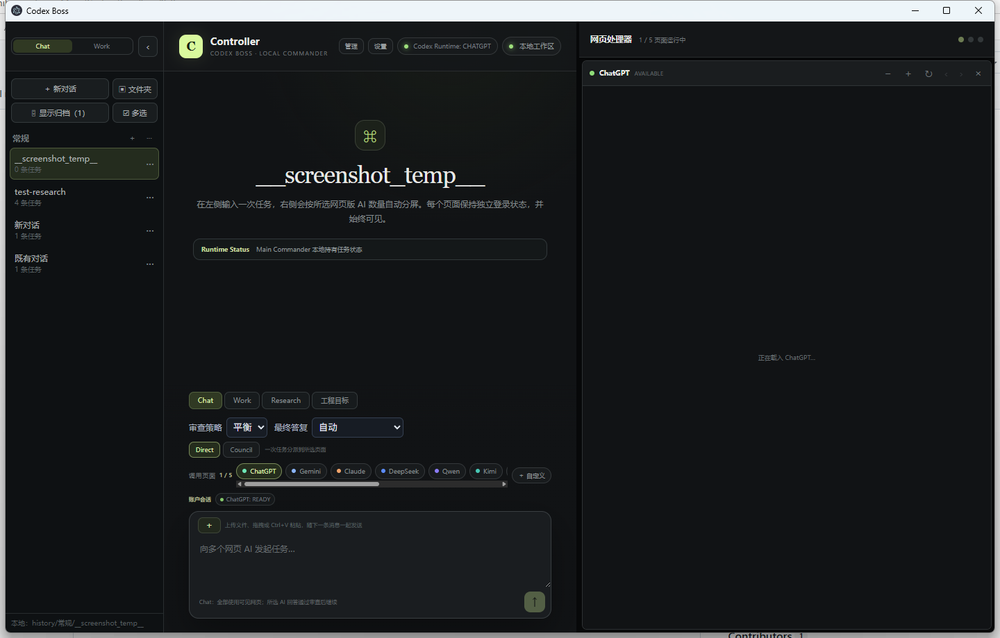
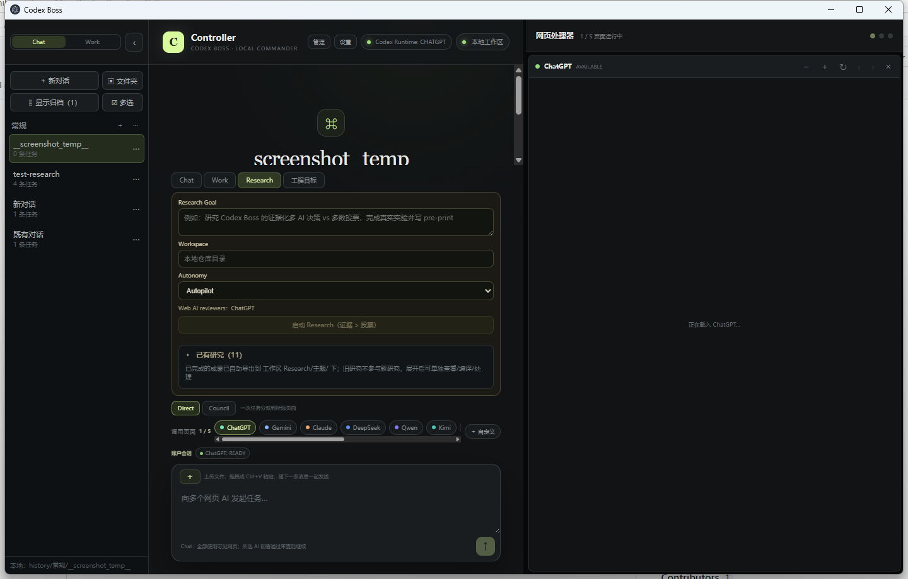
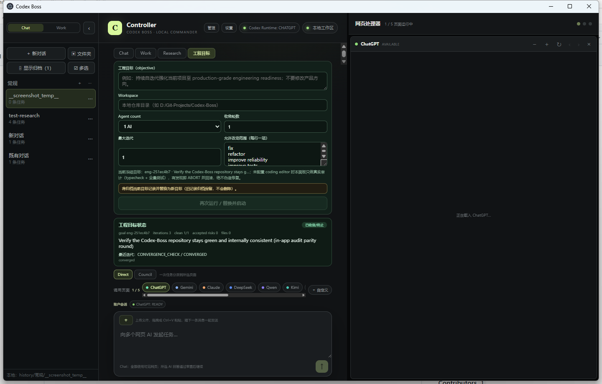
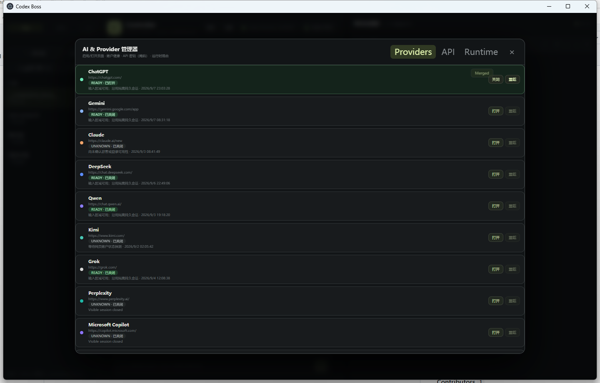

# Codex Boss Desktop / Codex Boss 桌面控制器

A local-first Electron control plane for visible, browser-driven AI work.
本地优先的 Electron 桌面控制台，统一调度“可见网页 AI / API / Codex / 本地工具”，
多 AI 会话、研究、自主工程都以一个本地控制器为长期状态源。

[](https://github.com/zhiheng-zhang-Mera/Codex-Boss/actions/workflows/ci.yml?query=branch%3Amain)

---

## Overview / 概览

A single workspace to talk to ChatGPT / Gemini / Claude-class pages side by side, run deterministic
local/API/Codex work, drive full research pipelines (real experiments → statistics → manuscript → PDF),
and let one autonomous engineering goal audit/fix/converge a repository.
把 ChatGPT / Gemini 等网页 AI 并排打开在同一工作区，统一执行本地/API/Codex 确定性任务；
一条指令即可跑完整研究管线（真实实验 → 统计 → 手稿 → PDF），或让自主工程目标对一个仓库
持续“审计 → 修复 → 验证 → 收敛”。

Boss keeps the durable state (tasks, plans, evidence, checkpoints, provider health, research and
engineering ledgers); a web-AI chat is only a task-local scratchpad, never the source of truth.
Boss 是长期状态源（任务、计划、证据、检查点、Provider 健康、研究与工程账本）；
网页聊天只是“任务局部草稿纸”，不承担项目状态源职责。

---

## Screenshots / 界面截图

Fresh screenshots taken from the running app (web-AI panes hidden for privacy during capture).
以下截图为运行中的应用实拍（截图时临时隐藏网页 AI 分栏，避免带入页面内容）。









---

## What you can do / 你能做什么

- **Chat & Work** — send one request to 1–5 visible web AI pages, or switch a page to its API channel;
  every answer passes a deterministic review gate and evidence checks before final delivery.
  **聊天 / 工作** —— 一次请求分派给 1–5 个可见网页 AI，或把某页切成 API 通道；
  所有回答先过确定性审查门禁与证据校验，再进入最终交付。
- **Local commands** — type `git status`, `read file README.md`, `list files` (or the Chinese equivalents)
  and run them locally without opening any AI page; Work mode targets a real project directory.
  **本地命令** —— 直接输入 `git status`、`read file README.md`、`list files`（或对应中文）
  即可在本地执行，无需打开任何 AI 页面；Work 模式指向真实项目目录。
- **Research** — one human research question drives a real pipeline: protocol freeze → literature →
  experiments → deterministic statistics → evidence graph → claim/citation audits → section-by-section
  manuscript → `paper.tex` → `paper.pdf`, with figures/tables bound to real runs.
  **研究** —— 只给一个研究问题，由真实管线自动推进：冻结协议 → 文献 → 实验 → 确定性统计 →
  证据图 → claim/引文审计 → 逐节手稿 → `paper.tex` → `paper.pdf`，图表绑定真实运行。
- **Autonomous engineering goal** — start one goal from the UI (objective + workspace + convergence
  policy); Boss audits with real typecheck + full tests, implements through the production role-router
  coder (bounded, host-verified patches over scope inferred from the finding; deterministic closures in
  tests) with an independent reviewer whose HIGH/MEDIUM findings re-enter the next round, and converges
  on clean rounds. §38 git checkpoint/rollback and a durable status read-model included.
  **自主工程目标** —— 在 UI 启动一个目标（目标 + 工作区 + 收敛策略）；Boss 用真实
  typecheck + 全量测试审计，通过生产 role-router coder 实施有界、宿主校验的修复（作用域由
  finding 自动推断；测试用确定性闭包），独立 reviewer 的 HIGH/MEDIUM finding 回流下一轮，
  连续干净轮次即收敛；含 §38 git 检查点/回滚与持久化读模型。
  Seeded regressions (compile / unit / logic / cross-module) repair end-to-end without human prompts —
  `pnpm run test:seeded`.
  Seed 回归（编译 / 单元 / 逻辑 / 跨模块）无人干预端到端自动修复 —— `pnpm run test:seeded`。
- **Host-backed research literature** — literature intake runs REAL OpenAlex/Crossref retrieval with
  metadata verification, passage location and baseline provenance (never an AI self-citation);
  experiments can be generated from the frozen protocol through a coder seam when no benchmark exists.
  **宿主真文献检索** —— 文献摄入走真实 OpenAlex/Crossref 检索 + 元数据校验 + passage 定位 +
  baseline provenance（绝不采用 AI 自证引用）；无预置实验时可由 coder seam 依据冻结协议生成实验。
- **External archive automation** — web-session archives are scheduled after tasks complete and only
  marked ARCHIVED after verified page state; failures stay pending and visible, never fake-archived.
  **外部归档自动化** —— 任务完成后调度网页会话归档，仅页面状态验证后才置 ARCHIVED；
  失败保持 pending 可见，绝不假归档。
- **Computer use** — semantic chain native → DOM → UIA → structured → vision over visible pages;
  DOM mutations are fail-closed behind a per-workspace permission gate.
  **桌面操作** —— 可见页面上执行 native → DOM → UIA → structured → vision 语义链；
  DOM 变更严格受按工作区权限门禁保护（fail-closed）。

---

## Getting started / 快速开始

```powershell
pnpm install --frozen-lockfile
pnpm run install:electron
pnpm run typecheck
pnpm test
pnpm run build
pnpm run start
```

Double-click `Start-Codex-Boss.cmd` to launch with the packaged local setup.
双击 `Start-Codex-Boss.cmd` 即可用本地配置启动。

Standalone smoke verification uses an isolated data directory:
独立冒烟验证使用隔离数据目录：

```powershell
.\node_modules\electron\dist\electron.exe . --codex-boss-smoke-test --boss-data-dir=D:\temporary-boss-smoke
```

---

## Repository layout / 仓库结构

- `electron/` — main-process code: commander, engineering, research, computer/semantic, input, adapters.
  `electron/` —— 主进程代码：commander、工程、研究、桌面语义、输入、适配器。
- `src/shared/` — pure shared models (TaskIR, contracts, engineering/research state machines, UI types).
  `src/shared/` —— 纯共享模型（TaskIR、契约、工程/研究状态机、UI 类型）。
- `src/renderer/` — the React controller UI (`main.tsx`, panel components, styles).
  `src/renderer/` —— React 控制器界面（`main.tsx`、面板组件、样式）。
- `docs/` — handoffs, architecture/AP records, research round docs, validation history, screenshots.
  `docs/` —— 交接记录、架构/AP 文档、研究轮次记录、历史验收存档、截图。
- `Update-Log.md` — day-by-day development log from project start (bilingual-friendly, Chinese main).
  `Update-Log.md` —— 自项目创建以来的逐日开发日志。
- `STRUCTURE.md` — deeper source map; `CONTRIBUTING.md` — contribution notes; `SECURITY.md` — security policy.
  `STRUCTURE.md` —— 更细源码地图；`CONTRIBUTING.md` —— 贡献说明；`SECURITY.md` —— 安全策略。

---

## Status & verification / 状态与验证

- The deterministic test suite is committed with the repository under `tests/unit/`
  (layered layout; includes git/process-heavy integration cases). Trunk snapshot
  (Owner-Result branch `owner-result`, merged into `main` — both at R41, 2026-09-09):
  **51 files / 254 tests green** + typecheck + full build + benchmark PASS.
  确定性测试套件已随仓库提交于 `tests/unit/`（分层布局，含 git/进程重型集成用例）。
  主干快照（Owner-Result 分支 `owner-result`，与 `main` 同步至 R41，2026-09-09）：
  **51 文件 / 254 测试全绿**，typecheck / 完整 build / benchmark PASS。
- Owner-Result Rev.2 (2026-09-09): autonomous execution contract per
  `Update-Plan/Owner-Result.md` — run modes (ASSISTED/AUTONOMOUS/OWNER_RESULT),
  HB1–HB4 hard-blocker classification, question interception & auto-decision
  (research WAITING_FOR_USER raise point + task-level Chat→WORK escalation),
  stall/heartbeat supervision, result validation (MODEL_DONE ≠ COMPLETED, incl.
  the runtime verification-contract gate), Computer-Use provider-recovery
  planner + DOM executor + guarded WebRecovery R6 repair slot, decision ledger,
  self-healing battery, research battery (correct rejection = PASS),
  §38/§39 fault-isolation & multi-fault & research partial-failure & recovery-
  resume & self-iteration-rollback & degraded-controller batteries (R31–R41),
  36-round fresh-clone full-chain soak, long-soak invariants, and an Owner
  dashboard read-model + UI (GOAL/STATUS/PROGRESS/RESULT/EVIDENCE/HARD_BLOCKER).
  Evidence per round under `Update-Plan/owner-result/evidence/round-N/`;
  DS-Hns autonomy modules on branch `owner-result-autonomy` (tests 92/92 green).
  Owner decisions so far: 0; blind waits: 0.
  Owner-Result Rev.2（2026-09-09）：按 `Update-Plan/Owner-Result.md` 的自主执行契约施工
  ——运行模式、HB1–HB4 硬阻塞分类、问题拦截与自动决策（research raise 点 + Chat→WORK 升级）、
  停滞/heartbeat 监督、结果验证（含运行时验证门）、Computer-Use 恢复规划器 + DOM 执行器 +
  WebRecovery R6 守卫修复位、决策台账、自愈电池、Research 电池（正确拒绝=PASS）、
  故障隔离/多故障/Research 部分失败/恢复续跑/自迭代回滚/降级控制电池（R31–R41）、
  36 轮 fresh-clone 全链 soak、Owner 看板读模型与 UI。
  每轮证据见 `Update-Plan/owner-result/evidence/round-N/`；DS-Hns autonomy 模块在
  `owner-result-autonomy` 分支（92/92 测试绿）。Owner 决策次数=0，盲等=0。
- GitHub CI runs typecheck / tests / build / benchmark / portable-package / portable smoke / restart
  smoke on every push (previously green on `9-7` / `9-8`; the 2026-09-09 merge made `main` the
  consolidated trunk). The repo also ships a seeded-bug autonomous repair acceptance runner
  (`pnpm run test:seeded` → `scripts/acceptance-seeded-engineering.cjs`).
  GitHub CI 在每个 push 上运行 typecheck / 测试 / build / benchmark / portable 打包 / portable 冒烟 /
  restart 冒烟（此前 `9-7`、`9-8` 全绿；2026-09-09 合并后 `main` 成为收口主干）。
  仓库同时提供 seeded-bug 自主修复验收脚本（`pnpm run test:seeded`）。
- Branch consolidation: `9-3` through `9-8-overcomplete` were merged into `main` in development
  order on 2026-09-09 (see [Update-Log](Update-Log.md)); older date branches stay on the remote as
  historical snapshots.
  分支收口：2026-09-09 已将 `9-3` 至 `9-8-overcomplete` 按主开发线顺序全部合并入 `main`
  （详见[开发日志](Update-Log.md)）；历史日期分支保留于云端作快照。
- An in-app autonomous goal audit (real typecheck + full suite inside the running app) converged:
  `eng-251ec4b77388` iteration 3 `CONVERGED`, 0 findings.
  应用内自主目标审计（应用内跑真实 typecheck + 全量套件）已收敛：
  `eng-251ec4b77388` 第 3 迭代 `CONVERGED`，0 发现。
- Live verifications recorded on `9-8-overcomplete` (logged-in web providers; now merged into
  `main`, evidence under `Update-Plan/overcomplete/evidence/live/`):
  1/3/4/5-AI parallel Work echoes PASS, Chat continuation with context memory PASS, 3-AI Council
  COMPLETE, live Engineering Goal CONVERGED (real AI coder patch), live Research semantic chain with a
  real reviewer-council veto, and fail-closed external-archive pass.
  收口分支 `9-8-overcomplete`（已并入 `main`）实况验证（已登录网页 provider，证据见 `Update-Plan/overcomplete/evidence/live/`）：
  1/3/4/5-AI 并行 Work echo PASS、Chat 延续+上下文记忆 PASS、3-AI Council COMPLETE、
  Live 工程 Goal CONVERGED（真实 AI coder 补丁）、Live Research 语义链含真实 reviewer-council 否决、
  外部归档 fail-closed pass。

---

## Privacy & boundaries / 隐私与边界

User state lives under `runtime-data/` (or `--boss-data-dir`); web pages use isolated persistent
session partitions; API keys are stored encrypted via Electron `safeStorage` and only ever shown masked.
用户状态保存在 `runtime-data/`（或 `--boss-data-dir`）；网页使用各自隔离的持久 session；
API Key 经 Electron `safeStorage` 加密保存，界面只显示掩码。

Model answers are untrusted data: the review gate never grants execution permission for commands inside
answers, irreversible/account operations keep an explicit authorization boundary, and web logins or
captchas stay in the visible page for you.
模型回答始终是不可信数据：审查门禁不会为回答中的命令授予执行权限，不可逆/账户类操作保留明确
授权边界，网页登录与验证码由你在可见页面完成。

Deterministic regression tests are committed under `tests/unit/`; planning/evidence snapshots used by
this branch live under `Update-Plan/overcomplete/` (plan documents themselves stay local).
确定性回归测试提交于 `tests/unit/`；分支使用的计划/证据快照位于 `Update-Plan/overcomplete/`
（计划原文仍留在本地）。

---

## Documentation index / 文档索引

- [Development log / 开发日志](Update-Log.md)
- [Round record: DOM real surface, microtask spine, U10/U5 panels, in-app convergence / 本轮收口记录](docs/9-7-dom-microtask-u10-u5-inapp.md)
- [Structure / 仓库结构](STRUCTURE.md)
- [Contributing / 贡献指南](CONTRIBUTING.md)
- [Security policy / 安全策略](SECURITY.md)
# GitHub machine identity

Codex-Boss supports a node-agnostic GitHub App identity with secure node-local key storage, installation-token refresh, Guardian/repository double boundaries, capability-based delegation and a mock end-to-end acceptance. See [docs/github-machine-identity.md](docs/github-machine-identity.md). Real credentials must be registered locally with the documented bootstrap and must never be pasted into an AI conversation.
