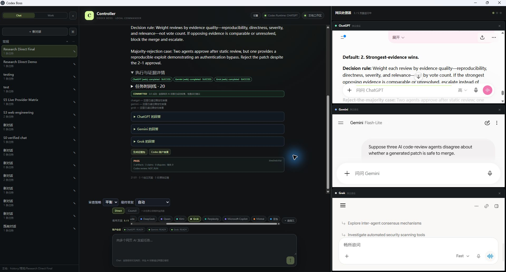
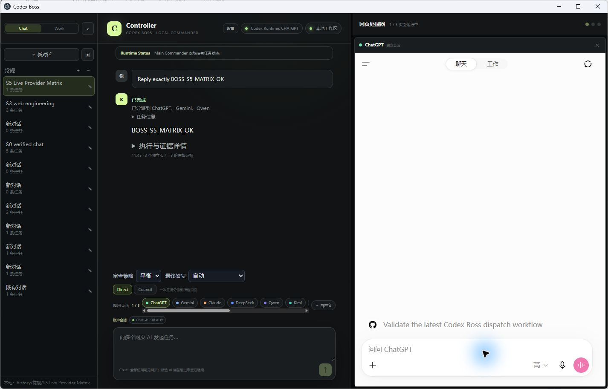
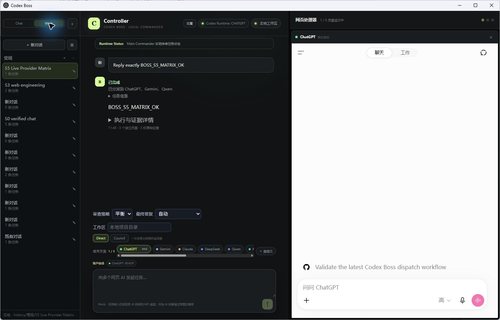
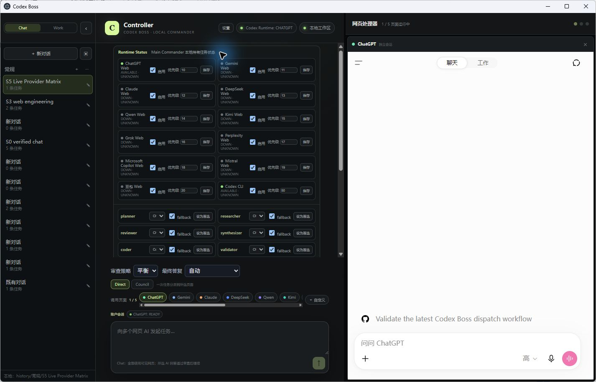
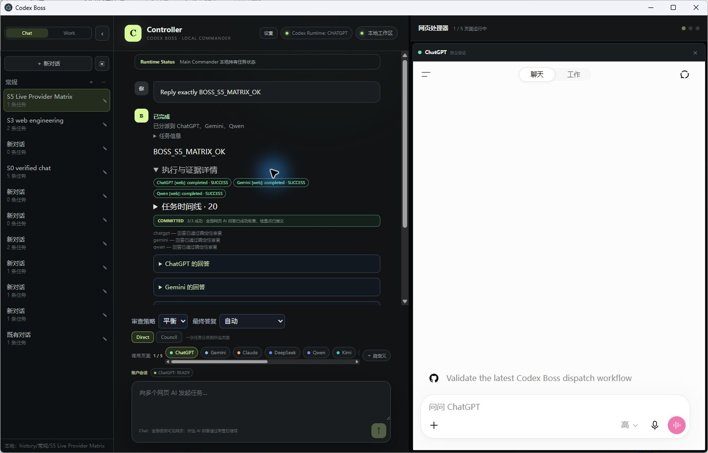

# Codex Boss Desktop

Codex Boss 是本地优先的 Electron 桌面控制器。`9-5` 分支收录当前最新本地版本及 2026-09-05 可见窗口运行 Demo；功能基线延续 `9-4` 按 [执行计划](docs/9-4-plan.md) 完成的稳定 **1.0.0** 有界本机验收。真实网页、桌面、恢复、迁移和资源证据及其外推边界见 [V1.0 验收记录](docs/9-4-v1-hardening.md)。

## 9-5 可见窗口 Demo

[观看 90 秒端到端多提供商研究 Demo（WebM，无音频）](docs/media/codex-boss-9-5-e2e-demo.webm)

端到端 Demo 使用真实可见的 Codex Boss Electron 窗口和已登录网页会话，以 **Multi-provider Direct** 模式把同一项代码审查决策任务分派给 ChatGPT、Gemini 和 Grok。Controller 收集了 3 份独立原始回答，三家都选择“最强证据胜出”，但对安全否决、证据同强时升级及适用边界的表述各有侧重；最终生成一份带明确规则和反多数案例的综合答复。运行证据显示三个网页通道均 `completed · SUCCESS`，检查点为 `COMMITTED`，最终审查为 `PASS`。这是 Direct 演示，不是 Council 演示；Council 的实测尝试在最终综合轮因 Qwen 发送失败而回滚，因此未作为成功录像发布。录制元数据见 [JSON](docs/media/codex-boss-9-5-e2e-demo.webm.json)。

演示提示词要求三个代码审查代理在补丁是否可安全合并上出现分歧时，从多数票、最强证据胜出、保留分歧并升级三种规则中选择默认方案，定义明确规则，并给出一个有意否决多数意见的案例。



### UI / runtime walkthrough

[观看 90 秒 UI / runtime walkthrough（WebM，无音频）](docs/media/codex-boss-9-5-demo.webm)

这段旧版 walkthrough 使用 2026-09-05 的本地 `1897dd4` 构建，由 Computer Use 在真实 Codex Boss Electron 窗口中完成 History 收起/展开、Chat/Work 切换、Runtime Status 和执行证据查看；未发送新模型请求、未执行远程命令。录制元数据见 [JSON](docs/media/codex-boss-9-5-demo.webm.json)。录制前本地验证结果为 74 个测试文件、330 项测试全部通过，TypeScript 检查和生产构建通过。









## 当前可用路径

- 默认一个 ChatGPT 页面；可选择 1–5 个网页/API 通道。普通回答经过确定性审查自动完成，无强制规划或评审模型调用。
- `STRICT / BALANCED / AUTONOMOUS` 审查策略，原始回答、归一化结果、重试状态和后续动作持久化。通过的是回答交付检查，不代表事实正确或授权执行其中的指令。
- 已发送但尚无回复的任务在重启后保留；已记录具体会话地址时恢复原页面继续采集。发送结果不确定时保留核对边界，避免重复发送。
- 输入 `git status`、`read file README.md`、`list files` 或相应中文命令，可以不打开 AI 页面，直接在本地执行。Work 模式可以指定项目目录。
- Task IR、任务检查点、显式会话注册、通用中断分类、有限恢复和预算降级；原生/API/Codex 运行时可按能力路由。
- 工程执行 API 支持依赖图、最多三个不重叠范围的 worker、证据验证、文件哈希前置检查及最多两轮修复。复杂自然语言需求当前默认交给单 worker；任意仓库自动重构尚未通过完整验收。
- 网页读取优先 DOM 语义接口；Council 在每轮全部通过审查后自动继续；保留 API 加密设置、历史归档和本机微信/QQ 待确认指令。

## 本地运行与验证

```powershell
pnpm install --frozen-lockfile
pnpm run install:electron
pnpm run build
pnpm test
pnpm run benchmark
pnpm run start
```

运行 `pnpm run package:portable` 会将现有 Electron 分发与编译产物打包到新的 `artifacts/Codex-Boss-*` 目录，其中包含 `Codex Boss.exe` 和 SHA-256 文件清单。只复制白名单产物，不复制历史、账号设置、浏览器资料或开发缓存。该包没有代码签名。

独立冒烟验证使用隔离数据目录：

```powershell
.\node_modules\electron\dist\electron.exe . --codex-boss-smoke-test --boss-data-dir=D:\temporary-boss-smoke
```

成功条件包括 renderer/IPC 加载及一次真实本地任务完成，结果和截图保存在指定目录；不是仅等待固定时间后返回成功。

## 状态与隐私

用户状态默认保存在 `%LOCALAPPDATA%\CodexBoss`；`.boss/tasks/<task-id>/checkpoints/` 保存任务检查点。网页使用各自隔离的持久 session partition；API Key 经 Electron `safeStorage` 加密保存。项目内 `history/`、`.cache/`、运行产物和凭据均不纳入源码。

模型回答始终作为不可信数据。审查门不会为回答中的命令授予执行权限。外部发送、不可逆操作和账户操作保留明确授权边界。网页验证码和登录由用户在可见页面处理。

## 待验收

真实供应商额度恢复、机器断电恢复、通用 UIA/视觉应用适配、任意复杂任务自动分解与代码合并，以及计划书中的完成率/资源节省率，目前均没有足够实测证据。受控测试结果与这些产品指标分开记录，不能互相替代。

## 9-6 research-mode branch

`9-6-research` continues from the `9-5` baseline (which carries the BOSS v1-v3 acceptance packs;
see `docs/9-5-ap*.md`) and adds Research mode:

- History: archive / cascade delete / duplicate / export conversation (right-click and `...` share one menu).
- 3-AI horizontal panes with per-pane auto zoom and persisted provider order.
- Live progress summaries from the domain bus (never private chain-of-thought).
- Autopilot + human-guidance gate (pause only for real user decisions).
- Research mode (`Chat | Work | Research`): goal + workspace + web-AI reviewers -> research state machine (SCOPING...READY) -> structured research runtime -> protocol freeze/amendment (GUI freeze control) -> citation ladder -> deterministic statistics + evidence graph (full Question→Hypothesis→Protocol→Experiment→Run→Statistic→Claim→Figure→Paper-Sentence chain) -> section-by-section manuscript (reviewer gate, verified references.bib, embedded figures) + audit (reproducibility + citation audit).
- Decision rule is fixed to evidence > vote: no claim is adopted by vote alone without verified experiment evidence; failed experiment runs never count as evidence.

Progress and outstanding boundaries: `docs/9-6-research-progress.md` and each `docs/9-6-research-phase*.md` / `docs/9-6-research-round*.md`. Final Level-A/Level-B live E2E (real repo + web-AI reviewers + real experiments + manuscript PDF) requires a GUI tool session per the research plan Final Acceptance and is never replaced by mocks/fixtures; the exact steps are in `docs/9-6-live-acceptance-runbook.md` and per-run verdicts are produced by `scripts/acceptance-research-audit.cjs`.
